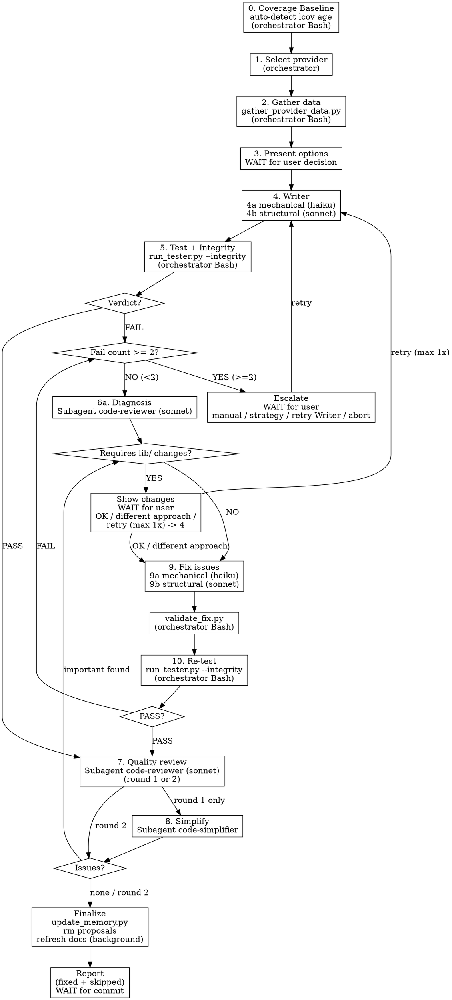

# Pipeline Diagram

```dot
digraph fix_pipeline {
  rankdir=TB;
  node [shape=box];

  baseline [label="0. Coverage Baseline\nauto-detect lcov age\n(orchestrator Bash)"];
  select [label="1. Select provider\n(orchestrator)"];
  gather [label="2. Gather data\ngather_provider_data.py\n(orchestrator Bash)"];
  present [label="3. Present options\nWAIT for user decision"];
  writer [label="4. Writer\n4a mechanical (haiku)\n4b structural (sonnet)"];
  test [label="5. Test + Integrity\nrun_tester.py --integrity\n(orchestrator Bash)"];
  verdict [label="Verdict?" shape=diamond];
  fail_count [label="Fail count >= 2?" shape=diamond];
  escalate [label="Escalate\nWAIT for user\nmanual / strategy / retry Writer / abort"];
  diagnose [label="6a. Diagnosis\nSubagent code-reviewer (sonnet)"];
  review [label="7. Quality review\nSubagent code-reviewer (sonnet)\n(round 1 or 2)"];
  simplify [label="8. Simplify\nSubagent code-simplifier"];
  review_issues [label="Issues?" shape=diamond];
  lib_check [label="Requires lib/ changes?" shape=diamond];
  lib_wait [label="Show changes\nWAIT for user\nOK / different approach /\nretry (max 1x) -> 4"];
  fix [label="9. Fix issues\n9a mechanical (haiku)\n9b structural (sonnet)"];
  validate [label="validate_fix.py\n(orchestrator Bash)"];
  retest [label="10. Re-test\nrun_tester.py --integrity\n(orchestrator Bash)"];
  retest_verdict [label="PASS?" shape=diamond];
  finalize [label="Finalize\nupdate_memory.py\nrm proposals\nrefresh docs (background)"];
  report [label="Report\n(fixed + skipped)\nWAIT for commit"];

  baseline -> select;
  select -> gather;
  gather -> present;
  present -> writer;
  writer -> test;
  test -> verdict;
  verdict -> review [label="PASS"];
  verdict -> fail_count [label="FAIL"];
  fail_count -> escalate [label="YES (>=2)"];
  fail_count -> diagnose [label="NO (<2)"];
  escalate -> writer [label="retry"];
  diagnose -> lib_check;
  review -> simplify [label="round 1 only"];
  review -> review_issues [label="round 2"];
  simplify -> review_issues;
  review_issues -> finalize [label="none / round 2"];
  review_issues -> lib_check [label="important found"];
  lib_check -> lib_wait [label="YES"];
  lib_check -> fix [label="NO"];
  lib_wait -> fix [label="OK / different approach"];
  lib_wait -> writer [label="retry (max 1x)"];
  fix -> validate;
  validate -> retest;
  retest -> retest_verdict;
  retest_verdict -> review [label="PASS"];
  retest_verdict -> fail_count [label="FAIL"];
  finalize -> report;
}
```
